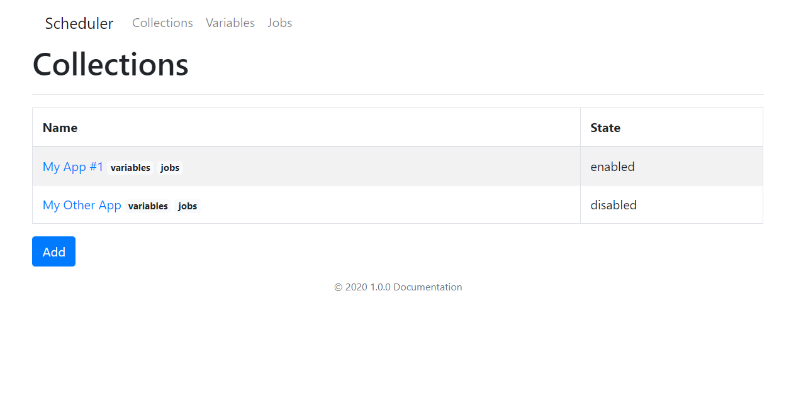
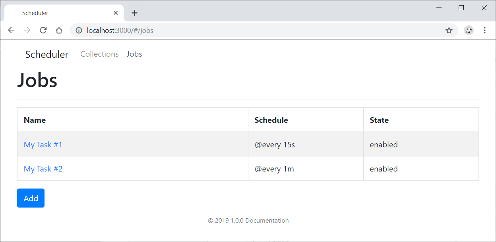
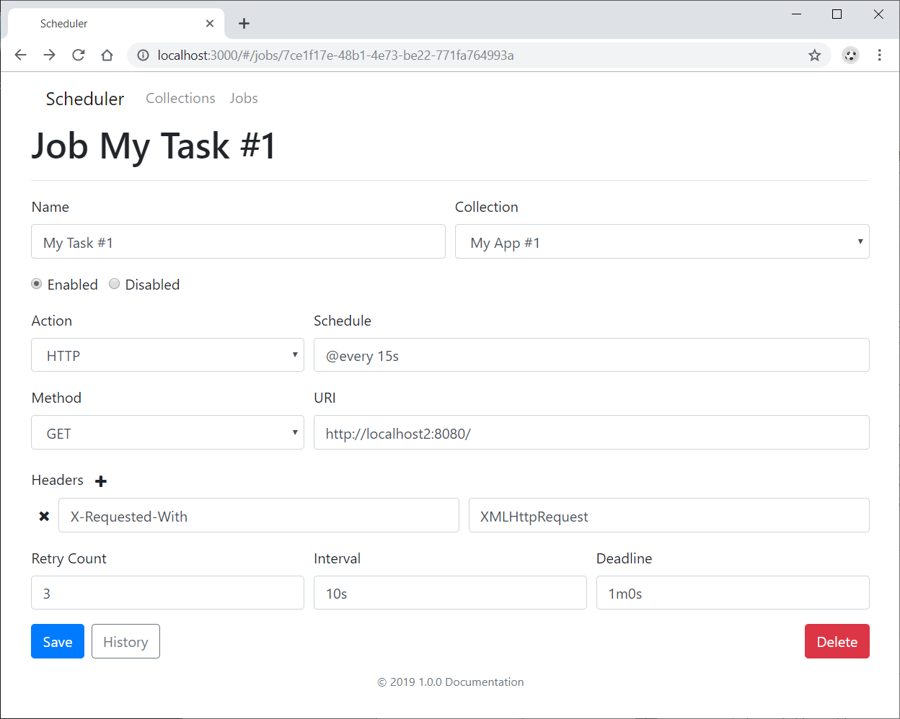
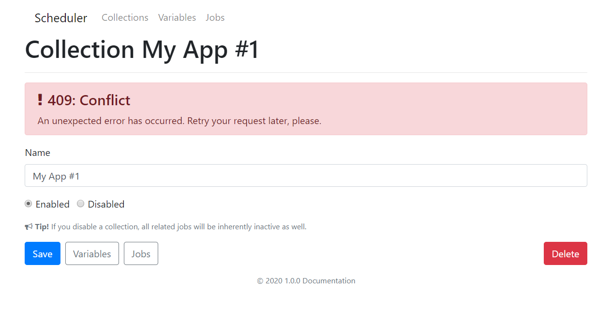
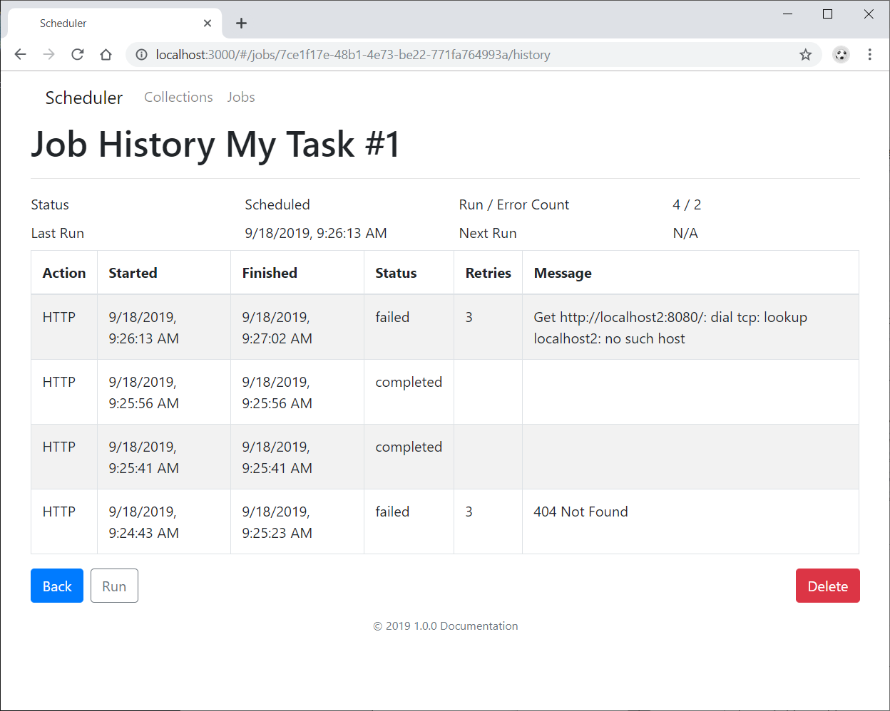
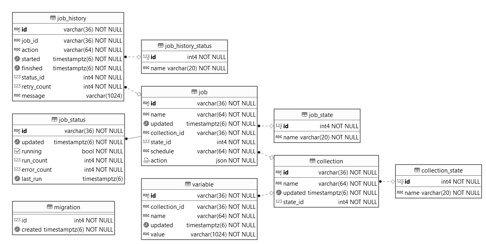

# Scheduler

[](https://github.com/akornatskyy/scheduler/actions/workflows/tests.yaml) [](https://coveralls.io/github/akornatskyy/scheduler?branch=master)

The scheduler is a fully managed cron job scheduler. It allows you to schedule virtually any job (e.g. such as calling HTTP/S endpoints). You can automate everything, including retries in case of failure, run jobs right away, on a recurring schedule, or at some point in the future.

The scheduler allows you to manage all of your automation tasks in a single place via simple UI or command line.

This service works on any Kubernetes cluster (such as Minikube), it’s easy to deploy with little to no configuration.

If you’re using this service, **★Star** this repository to show your interest, please!

## Screenshots

| Collections Page | Collection Details Page |
| --- | --- |
|  |  |
| **Variables Page** | **Variable Details Page** |
|  |  |
| **Jobs Page** | **Job Details Page** |
|  |  |
| **General Error Page** | **Job History Page** |
|  |  |

## Service Architecture

Scheduler Microservice is composed of scheduler service (HTTP API and SPA UI) that uses Postgres for persistence. The service part (HTTP, RESTful API, JSON) is written in Go, UI part is in Node.js (SPA, ES6, react, webpack). Packaged into a docker image and orchestrated by Kubernetes.


The service contains stateless parts (API) and stateful part (job scheduler and Postgres notification events subscriber).

There is Open API service [specification](./openapi.yaml) published [online](https://akornatskyy.github.io/scheduler).

The stateful part scales out by subscribing to Postgres notification events and refecting corresponding changes in job scheduler. The job scheduler ensures that only one job is run at a given point of time (although each instance has a full list of enabled jobs and competes to acquire one).

### Database Schema



## Installation

There are several installation methods:

1. Running locally.
2. Running with Docker Compose.
3. Running on Kubernetes.

> 💡 The service automatically migrates SQL schema.

### Option 1: Running locally

If you are going to play around first or contribute you might consider to run service locally.

First, set up environment variables by copying the example file:

```sh
cp .env.example .env.local
```

Edit `.env.local` to configure your database connection:

```sh
export DSN=postgres://postgres:@127.0.0.1:5432/scheduler?sslmode=disable
```

Then source the environment file and install dependencies:

```sh
source .env.local  # or `. .env.local`
make install
```

#### Production Build

Build both the web UI and API server:

```sh
make build
```

This builds the web app into `apps/api/static` directory. Start the service executable and navigate to <http://localhost:8080>.

#### Development Mode

For development with hot reloading, run both the API server and web dev server:

```sh
make dev
```

This starts:

- API server on <http://localhost:8080>
- Web dev server on <http://localhost:3000> (with hot reloading)

Navigate to <http://localhost:3000> for the best development experience.

You can also run them separately:

- `make dev-api` - runs only the API server
- `make dev-web` - runs only the web development server

### Option 2: Running with Docker Compose

You can use automatically built Docker [image](https://hub.docker.com/r/akorn/scheduler) from Docker Hub and start service right away.

```sh
cd misc/docker
docker compose up -d
```

View output from containers with `docker compose logs -f --tail=10`.

The service frontend should be available on port _8080_ of your docker machine.

For more information refer to files at the [`misc/docker`](./misc/docker) directory.

### Option 3: Running on Kubernetes

If you are using Minikube to run a Kubernetes cluster locally, start it via `minikube start`.

Roll out service with `kubectl apply -f misc/k8s`.

Run `kubectl get pods` to verify the pods are ready and running.

> NOTE: You can expose DB via `kubectl port-forward service/scheduler-db 5432`.

The service can be accessed with `minikube service scheduler`. Use `minikube dashboard` to access the Kubernetes dashboard running within the cluster.

### Cleanup

If you have deployed the application with docker compose, you can stop and remove containers with `docker compose down`.

If you have deployed the application with `kubectl apply -f misc/k8s`, you can run `kubectl delete -f misc/k8s` to clean up the deployed resources.

If you have deployed to minikube, stop the cluster with `minikube stop` or delete virtual machine with `minikube delete`.
